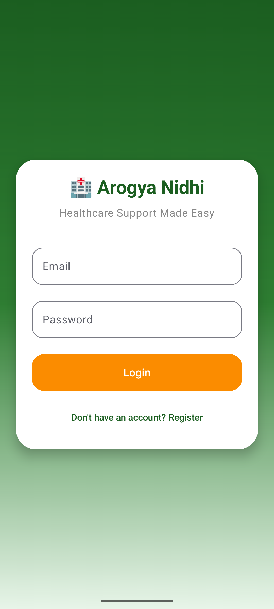
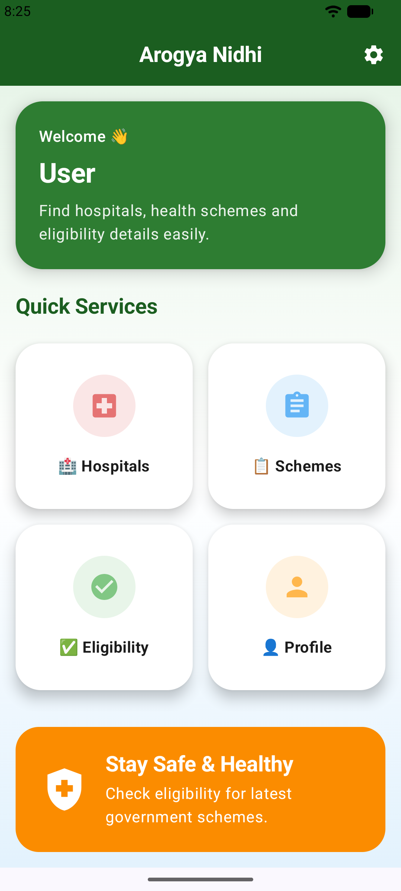
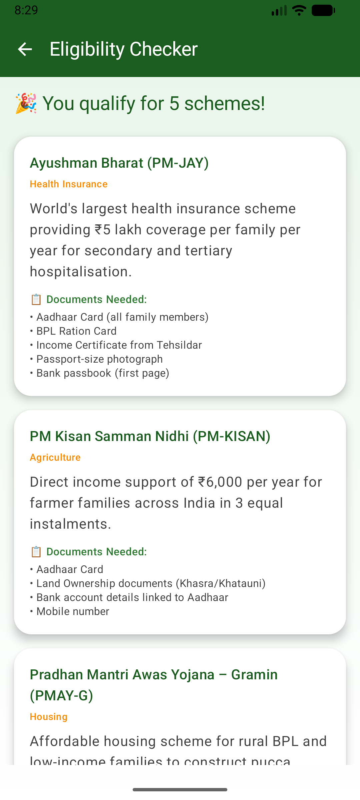
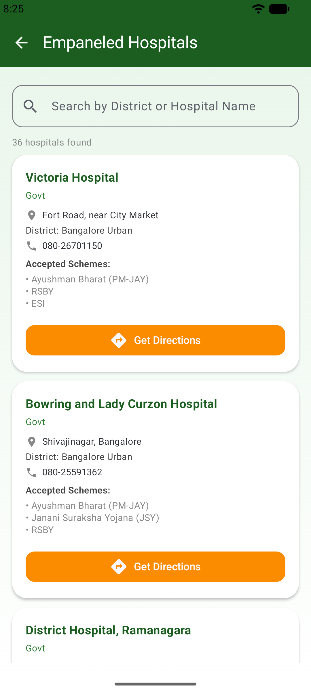
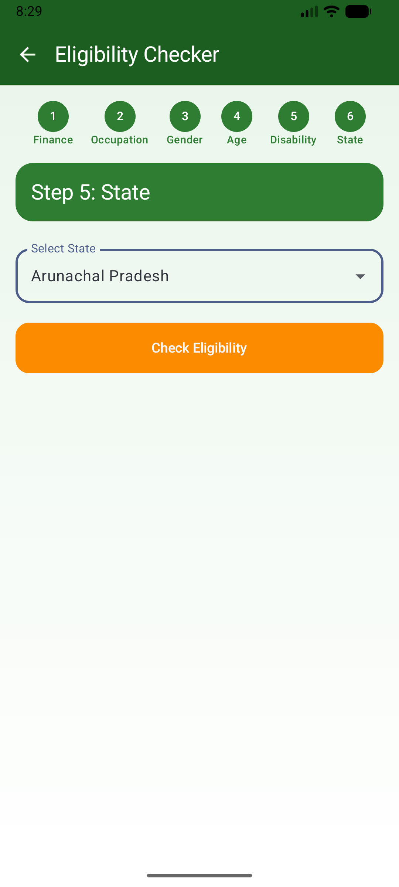
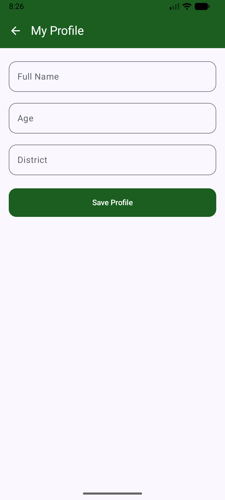
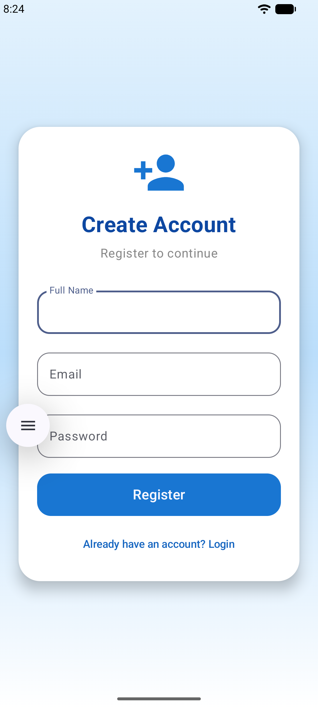

# 🏥 Arogya Nidhi
### Health Scheme Eligibility Checker
> Healthcare Support Made Easy — Built for Bharat

---

## 👩‍💻 Student Details
| Field | Details |
|---|---|
| Name | Shivani C Ail |
| USN | 4CB22CS118 |
| Email | shivanicail2004@gmail.com |
| Domain | Android App Development using GenAI |
| Category | Healthcare · Social Impact · Rural India |

---

## ❗ Problem Statement
Millions of Indian families in rural areas are entitled to free government health benefits but remain unaware. They end up paying out-of-pocket for treatments that could have been fully covered.

---

## 💡 About the App
**Arogya Nidhi** is a digital health counselor that:
- Checks eligibility for government health schemes in 6 simple steps
- Shows matched schemes with full benefit details
- Provides a document checklist for each scheme
- Helps find the nearest empaneled hospital

---

## ✨ Features
- 6-Step Eligibility Wizard (Finance, Occupation, Gender, Age, Disability, State)
- GenAI Decision Engine for scheme matching
- Scheme Results with document checklist
- Hospital Finder — searchable by District
- User Profile to save personal details
- Login and Register with Firebase Auth

---

## 📱 App Screenshots

| Secure Login | Quick Services Dashboard | Matched Schemes |
|---|---|---|
|  |  |  |

| Empaneled Hospitals | State Selection | User Profile | Register |
|---|---|---|---|
|  |  |  |  |

---

## 🛠 Tech Stack
| Layer | Technology |
|---|---|
| Language | Kotlin |
| Architecture | MVVM |
| Local Storage | Room Database + JSON |
| Authentication | Firebase Auth |
| GenAI Layer | Decision Tree Logic |
| Maps | Google Maps Intent |
| Testing | JUnit + Espresso |

---

## ⚙️ Installation & Setup

### Prerequisites
- Android Studio Hedgehog or later
- Android SDK API 24 (Android 7.0) or above
- JDK 17+
- Firebase project for Authentication

### Steps

**1. Clone the repo**
```bash
git clone https://github.com/shivaniail/Arogya_Nidhi.git
cd Arogya_Nidhi
```

**2. Open in Android Studio**
```
File → Open → Select the Arogya_Nidhi folder
```

**3. Add Firebase**
```
Place your google-services.json inside the app/ folder
```

**4. Sync Gradle**
```
File → Sync Project with Gradle Files
```

**5. Run the app**
```
Click ▶ Run in Android Studio
```

**6. Build APK**
```bash
./gradlew assembleDebug
```

---

## 📁 Project Structure
```
Arogya_Nidhi/
├── app/src/main/java/com/arogyawidhi/
│   ├── ui/           ← Login, Dashboard, Eligibility, Results, Hospitals, Profile
│   ├── viewmodel/    ← EligibilityViewModel, HospitalViewModel, ProfileViewModel
│   ├── repository/   ← SchemeRepository, HospitalRepository
│   ├── model/        ← Scheme, Hospital, UserProfile
│   ├── db/           ← AppDatabase, SchemeDao, HospitalDao
│   └── utils/        ← EligibilityEngine, JsonLoader
├── res/
│   ├── layout/
│   ├── values/       ← colors.xml, strings.xml, themes.xml
│   └── raw/          ← schemes.json, hospitals.json
├── screenshots/
├── build.gradle
└── README.md
```

---

## 🏛 Supported Schemes
| Scheme | Benefit |
|---|---|
| Ayushman Bharat (PM-JAY) | ₹5 lakh health coverage per family per year |
| PM Kisan Samman Nidhi | ₹6,000/year for farmer families |
| Pradhan Mantri Awas Yojana | Affordable housing for BPL families |
| Janani Suraksha Yojana | Cash support for maternal care |
| RSBY | Hospitalisation coverage for unorganised workers |

---

## 🎯 Impact Goals
- Universal Health Coverage for rural families
- Remove the information barrier for vulnerable communities
- Prevent medical debt by connecting families to free schemes
- Build digital literacy in rural India

---

## 🚀 Future Roadmap
- Hindi and regional language support
- Voice input
- WhatsApp share for eligibility report
- GPS Hospital Map
- AI Chatbot using Google Gemini API

---
